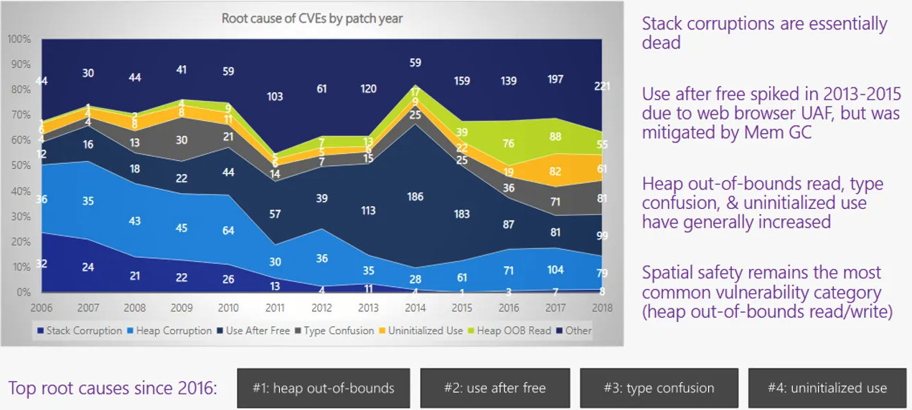

# Introduction

"Turbo 8 is dropping TypeScript" [^1]. The recent decision by David Heinemeier Hansson (DHH), the Ruby on Rails founder, to completely remove TypeScript from Turbo, a popular JavaScript framework, has reignited the heated debate about strongly typed vs weakly typed languages in the programming community.

Meanwhile, the recent launch of Mojo-lang, a new Python-like programming language that conversely bets on the power of strong typing, and the general popularity increase of languages like Rust [^2] shows that there is no clear path and that opinions about the usefulness of strong type checking in programming languages differ greatly.

Both the premise of perceived developer efficiency through weak typing and program safety through strong typing gain increasingly more traction online and promise to be the "right" paradigm.

The objective of this paper is to first introduce the concept of both weak and strong type checking and then build a better understanding of the motivations and resulting implications behind the choice of paradigm and potentially find a middle ground that results in both a safe and productive programming experience.

# History

Even the first commercially available high-level programming language Plankalkül had a form of types, be it a very simple one. It had only
one primitive type called a boolean. It quickly became clear that giving a program meaning and finding the correct representation in a language that only consisted of very basic elements was very difficult and that alternatives were needed.  

Some years later Short code[^3] gave programmers the ability to write mathematical expressions and have them evaluated by the computer, already making it a great improvement despite the slow runtime.  

Around the same time Russels Paradox [^4] gave rise to the back then new branch of mathematics called Type theory which has been growing ever so quickly and has found adoption in the fields of linguistics, programming languages, and even built a base for automated proving systems.  

Nowadays type theory has found great success in the context of modern programming languages like Rust which has shown how far a type system can be pushed.
# Background

## What are types?

### Foundations
Looking at it from the perspective of a computer a type gives a program guidance on how to interpret bits. As a compiler stores these bits in variables a type therefore defines the "set of all possible values that a variable of that concrete type can hold" [^5]. The simplest type is boolean which could be represented as a single bit which is either 0 / 1 or False / True respectively. But what makes types really useful is their capability to compose and build a completely new type from ther primitive types like integers, floats, and even arrays. An easy example for this would be a User type that consists of a name (String) and age (number). One could say that on a high level types give variables meaning and provide a way to discard false programs. Writing a function that expects a number and then providing it with a string would not make any sense even though both variables are just "bits". So automated type checking by the compiler greatly reduces these kinds of logic errors.
This fact becomes even more apparent when looking at programs of increasing size.

Furthermore typing in programming can be broken down into roughly 4 categories:

+ **Static typing** 
+ **Dynamic typing**
+ **Strong (strict) typing**
+ **Weak (less strict) typing**

Whereas the first two describe the time at which the type system applies its analysis the latter two describe the rules on how strict this analysis is and how easy it is to interpret a variable of one type as another.


It is important to note that strong and weak typing aren't real opposites but rather rules on how strict the compiler is before running the progamm[^7]. The two terms are often misused in the community and therefore also hard to formally define. [^6]
Languages like Python are generally considered weakly typed whereas static languages often get the reputation of having rather strict rules precompilation.

## Dynamic typing

In dynamic typing, the analysis is performed during runtime. Here it could happen that the programmer only notices his or her mistake when the program execution reaches the part where it "expected something of type A and was provided with something of type B". A prime example of dynamic and "weak" typing is Python.
```python
myvar = 3
myvar = "Hallo" 

def print_length(a):
  print(len(a))

print_length(myvar)
```

Here one can freely assign both a number and a string to myvar without the program being considered faulty. This small example will run fine as the value of myvar is a string when it is passed to the ```python print_length()``` function. This only becomes problematic when I forget to change myvar to a string and pass it holding the number value instead. I am again allowed to run the program but will realize while running it that it will crash as ```python len()``` only applies to iterators or arrays. One can quickly see that this can get out of hand quickly in a large codebase and lead to an increase in Runtime errors. Conversely, the loose restrictions make it easy to produce code quickly without having to fight the compiler.

## Static typing

The process of statically type-checking a program on the other hand means performing the analysis during compile time instead of runtime and prohibiting faulty programs from even starting. The example from above would fail to compile and run if I hadn't made myvar a subtype of iterator.
> Subtyping describes the relationship between multiple types where one can be freely exchanged for the other. Because String can be thought of as an iterator of characters it can therefore also be used where generic iterators are expected

Often but not always the term strongly typed goes hand in hand with statically typed language.
Without the help of type inference an automatic type detection of variables based on the composition of expressions that already have a well-defined type it is the job of the programmer to specify the correct type. In cases where the programmer isn't well acquainted with the exact rules of the language, this can pose a real challenge as the code must strictly conform to the exact set of rules expected by the compiler. Having to spell out the exact type definitions can lead to extreme cases like this where the actual thing the code tries to convey is much simpler than the verbose syntax that one has to read.[^15]


```rust
impl<A> Monad for Option<A> {
    fn bind<B, F>(self, f: F) -> Option<B>
    where
        F: FnMut(A) -> Option<B>,
    {
        self.and_then(f)
    }
}
``` 
> The bind operator together with 'return' are functions that define the Monad and are important operators, especially in functional programming

Note that this bind operator can also be expressed in Python but using it without the guidance of the compiler is much more error-prone if not understood correctly.

# Motivation
In the case of the original discussion about switching out TypeScript for JavaScript [^1lot of people argue that the static typing TypeScript provided was too valuable to let go of. Examples from the change list like:

```js title="src/core/drive/form_submission.js" del={1-2} ins={3-4} {6}
  //Typescript
- function buildFormData(formElement: HTMLFormElement, submitter?: HTMLElement): FormData {...}
  //JavaScript
+ function buildFormData(formElement, submitter) {...}
``` 
[^1] [^14]
show that it is easy to lose important semantics when doing refactorings like these. In the case of ```ts submitter?: HTMLElement```It is clear to the user of this function that this parameter is optional (indicated by the ? operator after the name). This information is completely lost in the JavaScript version and forces the user to take a look inside the function internals instead of just at its API. So what are the reasons for choosing one over the other?
## Productivity vs Correctness 

As mentioned earlier there is no clear cut between strongly and weakly typed languages which makes the choice even harder. It mostly boils down to the need for safety, speed (both development and program speed), program environment, and even personal preference where depending on the project the different factors have varying significance. A team that develops a new calorie-tracking app has other needs than a bank.  Nevertheless it goes without saying that prototyping is often much faster in weakly typed languages as they often provide a richer set of standard functionality, easier-to-understand syntax, and most importantly a large base of programmers who can be productive using it. In the case of young companies who are trying to get a foot in the business world, advice almost always includes being fast and agile. [^13] The reasoning behind this advice is that it is often much more favorable to reach a user base faster and gather feedback than to have the perfect product as it doesn't matter how secure or performant your software is if it just doesn't fulfill the user's needs.

## Security

Having made clear that classifying languages into strong and weakly typed isn't black and white but much more about assigning a shade of grey [^7] [^6] it is important to understand what modern type systems can do and how they can help especially in safety regulated areas where it is crucial that programs don't crash and fall victim to exploitation.

Image from "Microsoft: 70 percent of all security bugs are memory safety issues". [^11]  Top root causes for CVE


### The billion-dollar mistake

In 1965 Tony Hoare who invented Hoare Logic worked on the type system of the programming language ALOGL or rather its handling of references to be more precise. According to him "he couldn't resist the temptation to put in a null reference, simply because it was so easy to implement"[^8]. The big problem with null is that it behaves like an "invisible element" that is part of the set of each type. Not that it is completely invisible and people don't know about it but rather that it is ignored by the type system at compile time leading to countless runtime errors simply because it is so easy to forget a null check. 
One Solution is to incorporate static code analysis tools like Infer[^10] but over the years people have realized that it would also be beneficial to incorporate the "value of nothing" into the type system in a more visible way. A different approach than the hidden null like in Python, Java, javascript, etc. is to wrap the return values of operations that can fail in another type called Option (in Rust) or Maybe (in Haskell).

> Even Java incorperated it's own form of Option in the form of ```Java Class Optional<T>```, be it with a less ergonomic feel than in other languages.

```rust 
pub enum Option<T> {
    None,
    Some(T),
}
```
The sum type `Option<T>` either wraps any value of type T or evaluates to the option None. The main difference to null is that the type system knows about Option at compile time and forces the user to handle both cases. 
```rust 
fn get_user_by_id(id: usize, db: &Database) -> Option<User> {
  db.fetch(id)
}
fn print_username(user: &User)  {
  println!("The username is: {}", user.name);
}
```
Here get_user_by_id doesn't return the User itself but the wrapped version. If the user now wants to use the return value of this function he or she is forced to handle both cases because a function that expects a User won't accept 
``` rust Option<User>```.

```rust
let my_user: Option<User> = get_user_by_id(1);

print_username(my_user); //Error at compile time

if let Some(actual_user) = my_user { //Pattern match where real user 
  print_username(actual_user);
} else {//Handle the case where there is no user
  ...
}
```
### Solving concurrency issues through the type system

Another class of issues that is notoriously difficult and haunts many programmers is the one of concurrency issues. In languages like C pointers/references
to a variable can freely be shared among threads without any real restrictions. The ensuring of correct synchronization is completely up to the programmer and needs a lot of expertise and careful handling to get right. In more modern languages this issue is again tackled through the type system.
Rust introduces the notion of shared and exclusive references to objects with ```&```and ```&mut```[^16]. As only reading and no modifications are possible through shared references and reading can't introduce faulty program states they implement the Copy trait[^17] which makes them easily shareable between threads. ```&mut``` on the other hand cannot be copied or cloned as it is strictly forbidden to have 2 exclusive references to an object at the same time. If the programmer now wants to modify the value from 2 separate threads he or she is forced to again use a different type ```Arc<Mutex<T>>``` that forces them to handle synchronization. ```Arc<T>``` stands for Atomically reference counted pointer and lets the user share references to objects between threads. ```Mutex<T>``` on the other hand forces the user to acquire a lock before accessing the data inside. The value received by the lock is of type ```MutexGuard<'a, T: ?Sized + 'a>``` and called scoped lock. It is responsible for making sure there is always only one Thread accessing the value and automatically removing the lock when going out of scope. It does so by using a pattern called RAII (Resource acquisition is initialization) which was first introduced by C++ and makes sure that when creating a variable the memory for it is automatically allocated and deallocated when going out of scope.
As one can see, modern type systems can offer substantial guidance and solutions for prominent problems. The class of use after free bugs mentioned in the Security paragraph would not occur in a memory model like Rust under the restriction that no unsafe is used.
> As 100% safety is not possible in programming some internal libraries need to use unsafe code internally but are completely safe to use through their API design. e.g. Doubly linked list
However, this often comes at the cost of increased code verbosity, which some argue is too complex for effective use. [^9]

###  Guidance by standards

Another parameter to take into consideration when choosing a language is standards. The NSA for example has recently published a Document again referencing the study conducted by Microsoft that 70% of all software issues arise from memory safety issues.[^11] [^12]. In that document, the agency strongly suggests the use of what it considers memory safe Languages like C#, Go, Java®, Ruby™, Rust®, and Swift® arguing that in most cases the task of manually checking validity for those kinds of errors is infeasible and should be solved by either using inherently memory safe languages or in cases where this is not possible incorporate static code analysis tools to mitigate the risk of those issues as much as possible. They also acknowledge that newer programmers must endure a longer and steeper learning curve than with other languages but also insist that memory-safe languages become the new standard when developing new software.
# Conclusion

Types are a fundamental concept in programming languages and help the programmer by letting him express certain semantics and enforce rules at compile time. The typical categorization between different forms of typing isn't black and white but it helps in conversation.
In conclusion, the decision of whether to choose a strongly typed or weakly typed programming language incorporates more than just personal preference. By using Rust as an example like above it is clear that Type systems, while complex in some cases, can enhance software security and correctness, particularly in memory-related issues. Due to the rapid development of those new languages, one can also take advantage of simpler syntax and guidance by the compiler in the future while also embracing the language safety rules.

---

[^1]: [Davin Heinemeier Hansson. "Turbo 8 is dropping TypeScript"](https://world.hey.com/dhh/turbo-8-is-dropping-typescript-70165c01)

[^2]: [StackOverflow. "2023 Developer Survey"](https://survey.stackoverflow.co/2023/#overview)

[^3]: [Wikipedia contributors. "Short Code (computer language) - Wikipedia, The Free Encyclopedia"](https://en.wikipedia.org/w/index.php?title=Short_Code_(computer_language)&oldid=1176280478)

[^4]: [Wikipedia. "Russellsche Antinomie - Wikipedia, die freie Enzyklopädie"](https://de.wikipedia.org/w/index.php?title=Russellsche_Antinomie&oldid=238693192)

[^5]: [Bartosz Milewski. "Types and Functions"](https://bartoszmilewski.com/2014/11/24/types-and-functions/)

[^6]: [Wikipedia contributors. "Strong and weak typing - Wikipedia, The Free Encyclopedia"](https://en.wikipedia.org/w/index.php?title=Strong_and_weak_typing&oldid=1189081269)

[^7]: [Norman Ramsey. "Is C strongly typed?"](https://stackoverflow.com/a/430414/16965605)

[^8]: [Tony Hoare. "Null References: The Billion Dollar Mistake"](https://web.archive.org/web/20090628071208/http://qconlondon.com/london-2009/speaker/Tony+Hoare)

[^9]: [Hirrolot. "Rust Is Hard or the Misery of Mainstream Programming"](https://hirrolot.github.io/posts/rust-is-hard-or-the-misery-of-mainstream-programming.html)

[^10]: [Artem Pianykh, Ilya Zorin, Dmitry Lyubarskiy. "Retrofitting null-safety onto Java at Meta"](https://engineering.fb.com/2022/11/22/developer-tools/meta-java-nullsafe)

[^11]: [Catalin Cimpanu. "Microsoft: 70 percent of all security bugs are memory safety issues"](https://www.zdnet.com/article/microsoft-70-percent-of-all-security-bugs-are-memory-safety-issues/)

[^12]: [NSA. "Software Memory Safety"](https://media.defense.gov/2022/Nov/10/2003112742/-1/-1/0/CSI_SOFTWARE_MEMORY_SAFETY.PDF)

[^13]: [Deb Dutta. "Why is speed important for startup success?"](https://www.criya.co/article/why-is-speed-important-for-startup-success)

[^14]: [vfonic. "Comment on: Remove TypeScript?"](https://github.com/hotwired/turbo/pull/971#discussion_r1317386731)

[^15]: [FPComplete. "Monads and GATs in nightly Rust"](https://www.fpcomplete.com/blog/monads-gats-nightly-rust/)

[^16]: [RustTeam. "The Rust book: References and Borrowing"](https://doc.rust-lang.org/book/ch04-02-references-and-borrowing.html)

[^17]: [RustTeam. "The Rust book: Traits: Defining Shared Behavior"](https://doc.rust-lang.org/book/ch10-02-traits.html)
